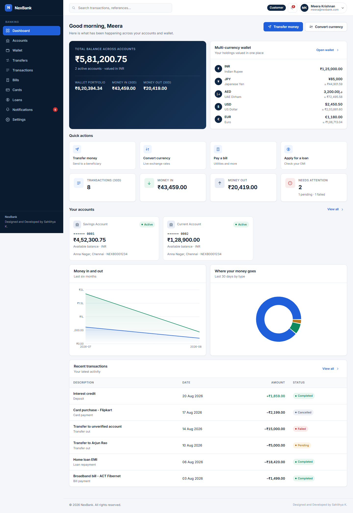
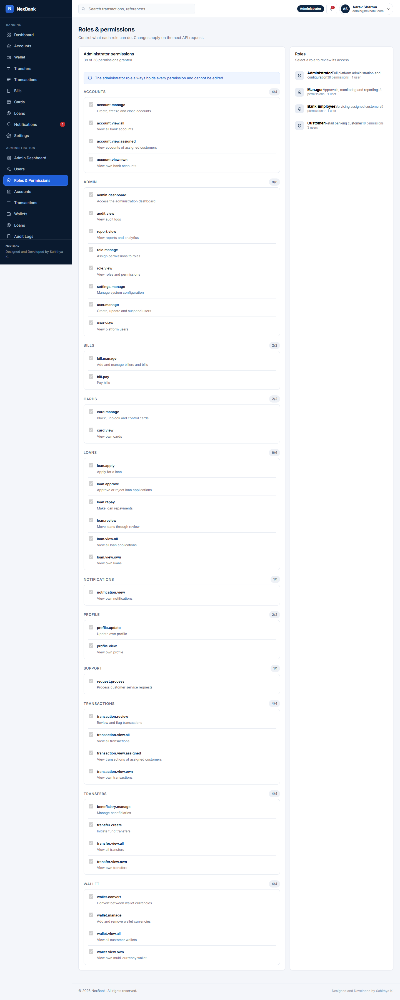
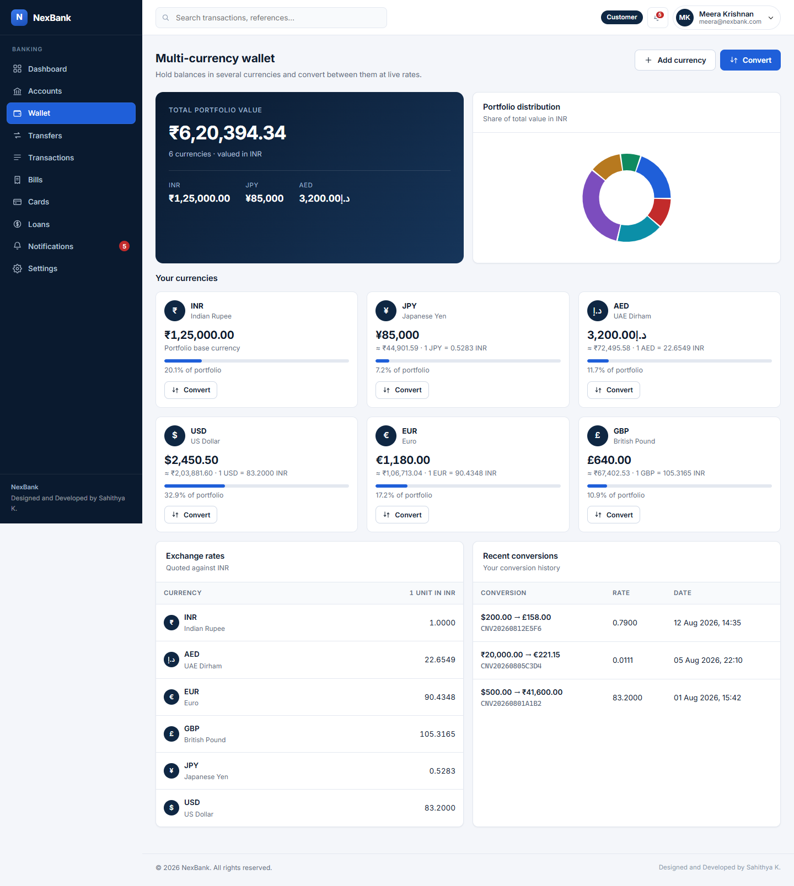
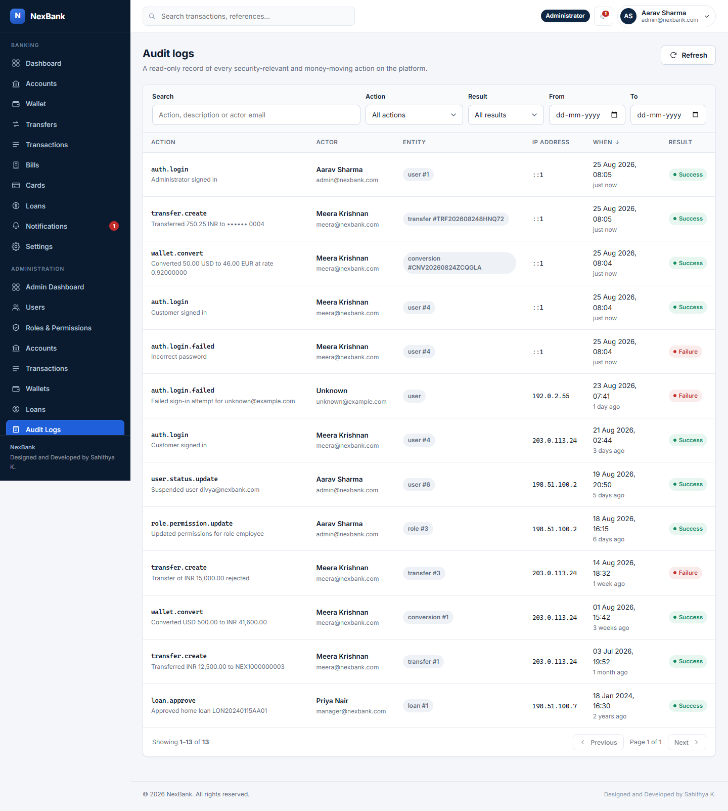
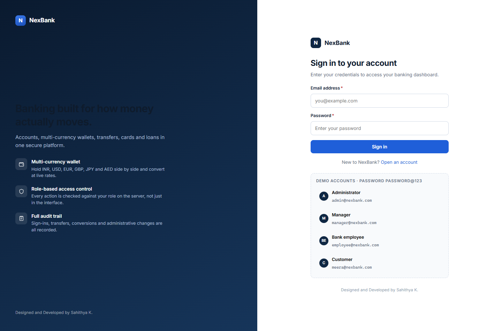
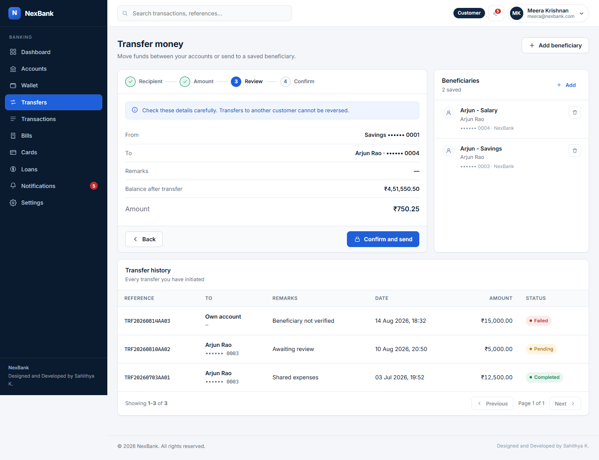
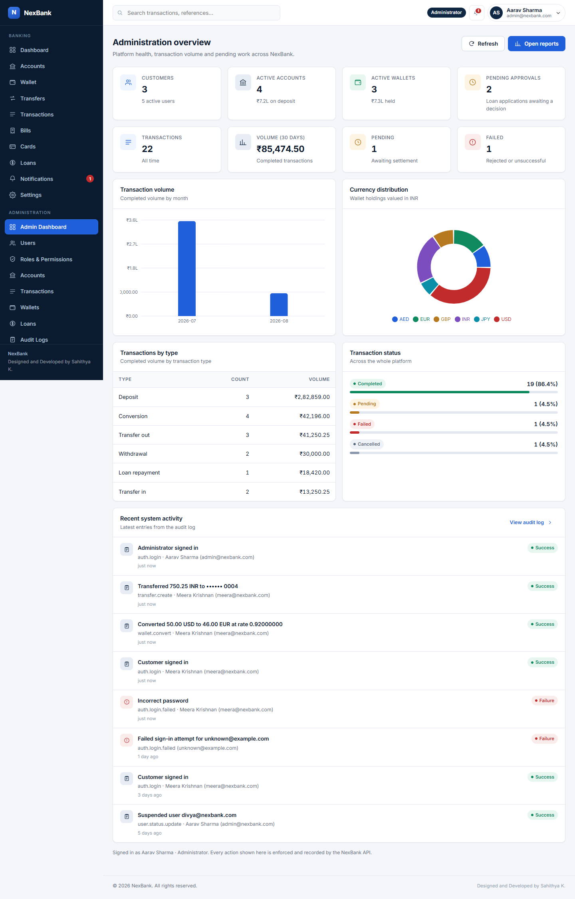
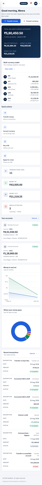

# NexBank

**Online banking SaaS platform** — multi-currency wallets, fund transfers, cards,
loans and full role-based administration, built on React, Node.js/Express and MySQL.

> Designed and Developed by **Sahithya K.**

---

## Overview

NexBank is a working digital banking platform, not a set of mock screens. Every
action in the interface runs the real thing: a transfer validates the request,
authorises it against the caller's role, checks the balance under a row lock, moves
money inside a MySQL transaction, writes both ledger entries, notifies both parties
and records an audit entry — and the UI reports success only once the server has
committed it.



---

## Features

### Banking
- **Accounts** — savings, current, salary and fixed-deposit accounts with masked
  numbers, per-account statements, date filtering and credit/debit totals.
- **Multi-currency wallet** — hold INR, USD, EUR, GBP, JPY and AED side by side,
  see the portfolio valued in one base currency, convert at live rates with a
  quote before committing, and review conversion history.
- **Transfers** — a four-step flow (recipient → amount → review → confirm) for
  own-account and beneficiary transfers, with account verification, idempotency
  keys that prevent duplicate submissions, and recorded failures.
- **Transactions** — a complete ledger with search, type/status/direction filters,
  date ranges, sorting and pagination.
- **Bills** — register billers across electricity, water, internet, mobile, DTH,
  gas and insurance; pay from any account; overdue detection and payment history.
- **Cards** — debit and credit cards with masked numbers, instant block/unblock,
  and controls for online, international and contactless use plus a daily limit.
- **Loans** — four products, a live EMI calculator, applications, manager approval
  with automatic disbursement, and repayment tracking that closes a settled loan.
- **Notifications** — transaction, transfer, security, payment and system alerts
  with read/unread state and filtering.

### Administration
- Platform dashboard: customers, active accounts and wallets, transaction volume,
  pending approvals, failed transactions, currency distribution and recent activity.
- User management, editable role permissions, account and transaction monitoring,
  wallet oversight, loan approvals, audit logs and reports.

---

## Technology stack

| Layer | Technology |
| --- | --- |
| Frontend | React 18, React Router, Vite, Recharts |
| Backend | Node.js, Express |
| Database | MySQL 8 |
| Auth | JWT (`jsonwebtoken`), bcrypt password hashing |
| Security | helmet, CORS allowlist, express-rate-limit, parameterised SQL |

---

## Architecture

```
React (Vite)  ──HTTP/JSON──▶  Express REST API  ──mysql2──▶  MySQL 8
   client/                        server/                    database/
```

Requests flow through one path on the server:

```
route  →  authenticate  →  authorize(permission)  →  validate  →  controller  →  service  →  MySQL
```

- **Routes** declare the permission each endpoint requires and validate input.
- **Controllers** stay thin: they unwrap the request and format the response.
- **Services** own all business logic and database access.
- **Money never touches a float.** Balances are `DECIMAL` in MySQL and decimal
  strings in JavaScript; arithmetic happens in SQL, or through a fixed-point
  BigInt helper (`server/utils/money.js`) where conversion maths is unavoidable.

```
NexBank/
├── client/                 React application
│   └── src/
│       ├── components/     Reusable UI (19 shared components)
│       ├── pages/          Customer screens
│       ├── pages/admin/    Administration screens
│       ├── layouts/        App shell and auth shell
│       ├── context/        Auth and toast providers
│       ├── hooks/          Data-fetching hooks
│       ├── services/       API client
│       ├── utils/          Formatting helpers
│       └── styles/         Design system
├── server/                 Express API
│   ├── config/             Environment and MySQL pool
│   ├── routes/             Endpoint definitions and guards
│   ├── controllers/        Request/response handling
│   ├── services/           Business logic and data access
│   ├── middleware/         Auth, RBAC, error handling
│   ├── utils/              Money, masking, validation, references
│   └── scripts/            Database setup
├── database/
│   ├── schema.sql          21 tables with keys, indexes and constraints
│   └── seed.sql            Demo dataset
└── docs/screenshots/
```

---

## Database design

A normalised schema of 21 tables with primary keys, foreign keys, indexes on lookup
and join columns, unique constraints and timestamps throughout.

| Group | Tables |
| --- | --- |
| Identity & access | `users`, `roles`, `permissions`, `role_permissions` |
| Money | `accounts`, `wallets`, `wallet_balances`, `currencies`, `exchange_rates`, `conversions` |
| Movement | `transactions`, `transfers`, `beneficiaries` |
| Products | `cards`, `billers`, `bills`, `bill_payments`, `loan_products`, `loans`, `loan_payments` |
| Platform | `notifications`, `audit_logs` |

Design decisions worth noting:

- **Currencies are data, not code.** A currency is a row in `currencies` plus one
  rate row; balances live in `wallet_balances` (one row per wallet × currency), so
  adding a currency requires no schema change and no frontend edit.
- `CHECK (balance >= 0)` on accounts and wallet balances, so the database itself
  refuses to hold a negative balance.
- `transfers` carries a unique `(sender_user_id, idempotency_key)` constraint,
  making a replayed transfer impossible rather than merely unlikely.

---

## RBAC

Four roles, with permissions stored in the database and resolved per request — a
permission change takes effect on the user's very next API call, with no redeploy
and no re-login.

| Role | Can |
| --- | --- |
| **Customer** | View profile, accounts and balances; manage the wallet and convert currency; transfer money; manage beneficiaries; view transactions; pay bills; manage cards; apply for and repay loans; view notifications |
| **Bank Employee** | View assigned customers' accounts and transactions, process service requests, review transactions, view loan applications |
| **Manager** | Everything an employee can, plus approve/reject loans, monitor all accounts, wallets and transactions, manage account status, and view reports and audit logs |
| **Administrator** | Full platform administration: users, roles and permissions, accounts, monitoring, system configuration, analytics and reports |

**Authorisation is enforced on the server.** Every protected route names the
permission it needs, and the API returns `403` regardless of what the interface
shows. Hidden navigation is a convenience, never the control:

```js
router.get('/all', authenticate, authorize('account.view.all', 'account.view.assigned'), controller.listAll);
```



---

## Multi-currency wallet

Rates are stored against a USD pivot, and any pair is derived as
`from → to = (USD→to) / (USD→from)`, so one row per currency covers every pair.

A conversion resolves the rate first, then opens a transaction that locks both
balance rows in a stable order, verifies the balance, debits, credits, writes the
conversion record and both ledger entries, notifies the customer and records the
audit entry — all committing or rolling back together.



---

## Getting started

### Prerequisites

- Node.js 18 or newer
- MySQL 8 running locally

### 1. Clone and install

```bash
git clone https://github.com/Sahithya74/NexBank.git
cd NexBank
npm run install:all
```

### 2. Configure the API

```bash
cp server/.env.example server/.env
```

Then edit `server/.env`:

| Variable | Purpose |
| --- | --- |
| `PORT` | API port (default `5000`) |
| `DB_HOST`, `DB_PORT`, `DB_USER`, `DB_PASSWORD`, `DB_NAME` | MySQL connection |
| `JWT_SECRET` | **Required.** Signing secret — generate a long random value |
| `JWT_EXPIRES_IN` | Token lifetime (default `8h`) |
| `BCRYPT_ROUNDS` | Password hashing cost (default `12`) |
| `CORS_ORIGINS` | Comma-separated allowlist (default `http://localhost:5173`) |
| `AUTH_RATE_LIMIT`, `API_RATE_LIMIT` | Per-IP request limits per window |
| `SEED_PASSWORD` | Password given to the demo accounts by `db:setup` |

Generate a secret with:

```bash
node -e "console.log(require('crypto').randomBytes(48).toString('hex'))"
```

`server/.env` is git-ignored and must never be committed.

### 3. Create the database

```bash
npm run db:setup
```

This applies `database/schema.sql`, loads `database/seed.sql`, and hashes the demo
password at load time — no password hash is committed to the repository. Use
`-- --schema-only` to skip the demo data.

### 4. Run

```bash
npm run dev:server   # API   → http://localhost:5000
npm run dev:client   # App   → http://localhost:5173
```

The Vite dev server proxies `/api` to the backend, so no CORS setup is needed
in development. Build the frontend with `npm run build`.

### Demo accounts

All demo accounts use the password **`Password@123`**.

| Role | Email |
| --- | --- |
| Administrator | `admin@nexbank.com` |
| Manager | `manager@nexbank.com` |
| Bank employee | `employee@nexbank.com` |
| Customer | `meera@nexbank.com` |
| Customer | `arjun@nexbank.com` |

---

## API overview

All responses share one envelope:

```json
{ "success": true,  "data": {}, "message": "" }
{ "success": false, "error": { "code": "INSUFFICIENT_FUNDS", "message": "..." } }
```

| Resource | Endpoints |
| --- | --- |
| `/api/auth` | `POST /register`, `POST /login`, `POST /logout`, `GET /me`, `PUT /me`, `PUT /password` |
| `/api/accounts` | `GET /`, `GET /summary`, `GET /:id`, `GET /:id/statement`, `GET /:id/number`, `GET /all`, `POST /`, `PATCH /:id/status` |
| `/api/wallets` | `GET /`, `GET /quote`, `POST /convert`, `POST /transfer`, `POST /currencies`, `DELETE /currencies/:code`, `GET /conversions`, `GET /transactions`, `GET /all` |
| `/api/currencies` | `GET /`, `GET /rates`, `GET /quote`, `POST /`, `PUT /:code/rate`, `PATCH /:code/status` |
| `/api/transfers` | `POST /`, `GET /`, `GET /:reference` |
| `/api/transactions` | `GET /`, `GET /:reference`, `GET /summary`, `GET /analytics`, `GET /filters` |
| `/api/beneficiaries` | `GET /`, `GET /verify`, `POST /`, `PUT /:id`, `DELETE /:id` |
| `/api/cards` | `GET /`, `GET /:id`, `GET /:id/transactions`, `PATCH /:id/status`, `PATCH /:id/controls`, `GET /all` |
| `/api/bills` | `GET /`, `GET /billers`, `GET /history`, `POST /`, `POST /:id/pay`, `DELETE /:id` |
| `/api/loans` | `GET /products`, `GET /quote`, `GET /`, `GET /:id`, `POST /`, `POST /:id/repay`, `GET /all`, `PATCH /:id/review`, `PATCH /:id/decision` |
| `/api/notifications` | `GET /`, `GET /unread-count`, `PATCH /:id/read`, `PATCH /read-all`, `DELETE /:id` |
| `/api/users` | `GET /`, `GET /:id` |
| `/api/admin` | `GET /dashboard`, `GET /reports`, `GET /staff`, users CRUD, `GET /roles`, `PUT /roles/:id/permissions` |
| `/api/audit-logs` | `GET /`, `GET /actions` |

---

## Security

- Passwords hashed with bcrypt; plaintext is never stored or logged.
- JWT bearer authentication, with the user record and permissions re-read from the
  database on every request rather than trusted from the token.
- RBAC middleware on every protected route.
- Server-side validation on all input; client validation is UX only.
- Parameterised queries throughout — no SQL is built by string concatenation, and
  sort columns come from an allowlist.
- Account, card, phone and email values are masked before leaving the server. A
  customer can reveal their own account number, and each reveal is audited.
- helmet, an explicit CORS allowlist, and per-IP rate limits (tighter on
  credential endpoints).
- Errors return a stable machine code and a user-safe message; SQL text, driver
  codes and stack traces never reach the client.
- `.env` files, credentials and secrets are git-ignored.

---

## Audit log

Sign-ins, failed sign-ins, transfers, conversions, bill payments, loan decisions,
account status changes, role and permission edits and administrative actions are
all recorded with the actor, action, entity, description, result, IP address and
timestamp.



---

## Screenshots

| | |
| --- | --- |
|  |  |
| **Sign in** | **Transfer review step** |
|  |  |
| **Administration overview** | **Responsive layout** |

---

## Testing

The platform was verified end to end against a live database and a real browser:

- **104 API checks** — authentication, RBAC denial paths for each role, exact
  balance arithmetic on conversions and transfers, insufficient-balance handling,
  duplicate-transfer prevention, double-payment and double-approval prevention,
  filtering, sorting, SQL-injection resistance on sort columns, and verification
  that no SQL detail leaks in error responses.
- **64 browser checks** — the real UI driven in Chrome: sign-in and invalid
  credentials, protected-route redirects, a live currency conversion, a completed
  transfer through the multi-step flow, every customer and admin screen, RBAC
  differences between customer, employee and administrator, and mobile/tablet
  layout with no horizontal overflow.

---

## Developer

**Designed and Developed by Sahithya K.**

Repository: <https://github.com/Sahithya74/NexBank>
